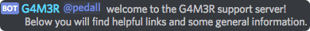

# Hibye

The Hibye command is a great command that can be used together with [Embed](../utility/embed.md) to create great welcome _\(hi!\)_ and goodbye _\(bye!\)_ messages. There are quite a few aliases for the hibye command but lets keep it simple for now.

### Use: `[prefix]hibye <hi/bye> <enable/disable/set/get>`

Lets break down the command line:  
`[prefix]hibye` Letting the bot know you want to use this command \(aliases below\)  
`<hi/bye>` View or edit `hi`or `bye` part of the command.  
`<enable/disable/.../...>` Enable/disable the command in the current channel.  
`<.../.../set/get>` To insert a new message choose `<set>`. Or view the current message with `<get>`

**Aliases for hibye:**

* `[prefix]hi`
* `[prefix]bye`
* `[prefix]welcome`
* `[prefix]goodbye`

## Examples:

**View** the current welcome/hi message: `[prefix]hi hi get`

**Disable** the bye message in the current channel: `[prefix]hibye bye disable`

**Set** a new welcome message: `[prefix]hi hi set {embededmessage}`

**Preview:**

`[prefix]hi hi enable`

`[prefix]hi bye disable`

You can set the welcome message with just text, or with a pretty embed message.  
Values that you can use for the welcome message:

| Author related: | User related: | Guild related: |
| :--- | :--- | :--- |
| %author% | %user% | %guild% |
| %authormention% | %usermention% | %guildimage% |
| %authorimage% | %userimage% |  |

**A %usermention% welcome message:**

**An example of the author values + guild values.**

If you want to know how to set up an embed message, check [Embed.](../utility/embed.md)

_Did you know? You can even disable the bye message like this:_ `[prefix]hibye disable`  
_As hi/bye/welcome/goodbye are aliases for the calling the same command it doesnt matter which one you enter directly after the prefix._

