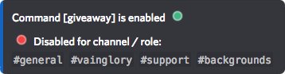
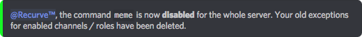

# Permission

The **Permission** command lets you active or deactivate the usage of a specified command in a specific channel.  
You can easily view information about the set permissions.

**Get permission information:**

`[prefix]permission` _View all commands with special permissions defined._

`[prefix]permission <command>` _View permission settings from specified command._

`[prefix]permission <@role>` _View the permission settings of @role or role ID._

## Preview:

## Set permissions:

`[prefix]permission enable|disable <command name>` _Enable/Disable the use of an command for the whole server. This deletes old set permissions for that command on the server._

`[prefix]permission enable|disable <command name> <@role|#channel|id>` _Enable/Disable the use of an command for a specified @role or \#channel. This deletes old set permissions for the specified command regarding the specified @role / \#channel.  
  
**Pro-Tip:**  
You can also disable a command for the WHOLE server, and then enable it in the channels where you want to allow it. For example: `[prefix]perm d ping all` this deactives the use of `[prefix]ping` in all your channels. `[prefix]perm e ping #botcommands` enables the use of `[prefix]ping` in the channel `#botcommands`._

## Preview:

`[prefix]permission remove <command name>` _Removes all current exceptions for the specified command._

`[prefix]permission remove <command name> <@role|#channel|id>` _Removes all current exceptions for the specified command regarding the specified @role, \#channel or ID._

## Preview:

