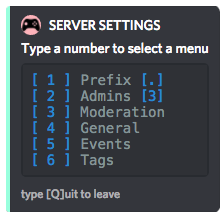
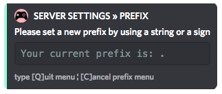
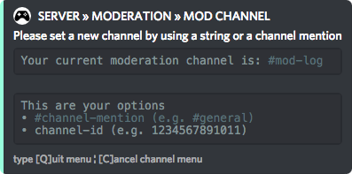
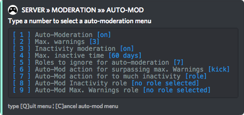
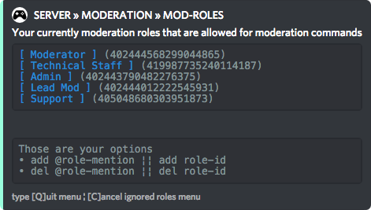
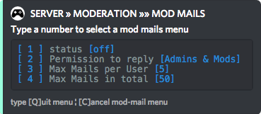
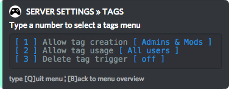

# Settings

Diving into customising the bot for your server. The **Settings** command is one of the more complex menu's but absolutely easily accessible due to the structure. All different server settings are categorised under their own tabs which are quickly accessible through a direct command.

## Server Settings:

_Command:_`[prefix]settings`

## \[1\] Prefix

You put the _prefix infront of a command_, so that the bot knows you want to **use a command**.  
Customising the prefix is possible in this menu. For a more detailed guide about the prefix, go [here](../../setting-up/prefix.md).

**Direct menu command:** `[prefix]s prefix`

**Direct prefix change command:** `[prefix]s prefix [newprefix].`

## \[2\] Admins

In the admins menu you can add and remove admins.  
To add an admin use: `add @mention`  
To delete an admin use: `del @mention`

Be aware that when you add an admin they can **access ALL** the server settings as well.

**Direct menu command:** `[prefix]s admins`

## \[3\] Moderaton

**Direct menu command:** `[prefix]s mod`

* **\[1\] Mod Log Status**

  Turn the log status on or off. The Mod Log consists of automatically generated messages of any warn / kick / ban and auto moderation in the whole server.

* **\[2\] Mod Log Channel**

  You can select any channel \(where the bot has rights\) for the mod log to automatically send the status messages.  
  Select option 2 and then enter the \#channel-name to select the channel.  
  

* **\[3\] Mod Log Colors**

  You can change the colours of the warn, kick and ban log messages. The colour codes are hex-codes.  
    
  If you want to change the colour, for example of warnings to yellow, use: `warn #EEE514` it will then look like this:

  

* **\[4\] Auto-Moderation**

  **\[1\] Turn on/off** the auto-moderation on your server.**  
  \[2\] **Change the **max. amount of warnings** someone should receive _BEFORE_ auto-moderation kicks in.**  
  \[3\] Turn on/off** the inactivity moderation on your server.  
  **\[4\] **The time between a person is _allowed to be inactive_ before **auto-moderation** kicks in. This is from their last sent message.  
  **\[5\] **You can add roles to the bot that it will **ignore for the auto-moderation**. For example your moderators, when learning the commands.  
  **\[6\]** What will happen when someone surpasses the max. amount of warnings on your server. You can choose between _kick_ / _role_.  
  **\[7\]** What will happen when someone surpasses the amount of time between their last message and now. _Kick_ or _Role_.  
  **\[8\]** You can @mention the role here you want to choose for the auto-moderation **inactivity** role.  
  **\[9\]** You can @mention the role here you want to choose for the auto-moderation **warnings** role.

  

* **\[5\] Moderation Roles**

  To add roles that are allowed to use moderation with the G4M3R bot.  
  `add @role` or `del @role` to add or delete a role from this list.

* **\[6\] Moderation Mails**

  Here you can turn on/off in-server mailing, reply permission \(All, mods & admins, admins only\).  
  Also the max \(active\) mails per user and how many they in total are allowed to send.

  

### \[4\] General

In the general tab you can set up GENERAL server settings, like the default server timezone and the default time of menu's closing. _\(Don't forget to close the menu with Q, or go back with B\)_

## \[5\] Events

**\[1\]** Turn on/off event creation permissions. **All users / admins & mods / admins only.**

**\[2\]** **Turn on/off** the settings of 3-7 are **default settings** for every event created on the server.

**\[3\]** Set the default event type. **Gaming / Community / Calendar.**

**\[4\]** Set the default duration for all server events.

**\[5\]** Set the default max. attendees for all server events.

**\[6\]** Set default platform. **STEAM / PS4 / XBOX / BNET / UPLAY / NINTENDO / MOBILE.**

**\[7\]** Insert the default game for the server. _\(Very useful for clan / guild discords!\)_

## \[6\] Tags

**\[1\]** Set who is **allowed to create tags**._ All users / Admins & mods / Admins only._

**\[2\]** Set who is allowed to **"trigger" **\(use\) **tags **in the server. _All users / admins & mods / admins only_.

**\[3\]** Deletes the name of the tag when spoken in the chat.

