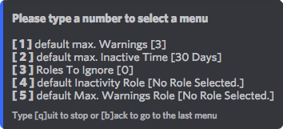
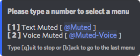
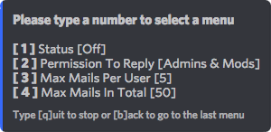
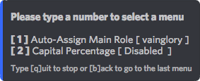
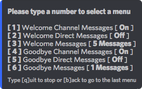
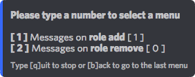
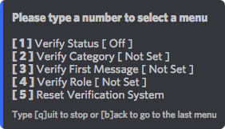

# \[3\] Moderation

## \[3\] Moderaton

**Direct menu command:** `[prefix]s mod`

* **\[1\] Mod Log**
  * Turn the log status on or off.
  * Choose the channel for your log
  * Customise the colours for your mod log  
    You can change the colours of `warn`, `kick` and `ban` log messages.  
    The colour codes are [hex-codes](https://htmlcolorcodes.com/).  
    If you want to change the colour, for example of warnings to yellow, use: `warn #EEE514` it will then look like this:

    

  
    _The Mod Log consists of automatically generated messages of any warn / kick / ban and auto moderation in the whole server._ 

    

* **\[2\] Default Moderation Values**

  * Set the maximum amount of warnings that a user can receive.
  * Set maximum inactivity time.
  * Insert roles that the bot will ignore with auto moderation.
  * Set the role that inactive members will automatically receive.
  * Set the role that members who have been warned the set amount of times will receive.  

  
  

* **\[3\] Moderation Roles**

  Add roles that are allowed to use the moderation features.  
  Be careful! Everyone with this role will be able to kick / ban users. Only give it to people who you trust! 

  

* **\[4\] Mute Roles Menu**   Choose which roles are used with Text Muted and Voice Muted. 

* **\[5\] Moderation Mails** With the settings of the Mod Mails you can customise this feature to your server. - Turn the mod mails on/off - Set who is allowed to reply to these mails. - Maximum amount of open mails per user. - Maximum amount of open mails in total on the server.  
* **\[6\] Auto-Moderation** Automatically assign roles and catch those CAPS SPAMMERS. You can set the percentage of CAPS allowed on the server AND turn it on at _**\[2\] Capital Percentage**_ **** 

* **\[7\] Welcome / Goodbye**
  * \[1\] Turn on the welcome messages in a specified channel.
  * \[2\] Turn on and set welcome _Direct Messages_.
  * \[3\] Insert your welcome messages here, embeds look really nice! Check [Embed ](../../utility/embed.md#use-less-than-prefix-greater-than-embed-optional-user-embed-from-nadeko-builder)on how to create them.
  * \[4\] Turn on the goodbye messages in a specified channel.
  * \[5\] Turn on and set welcome _Direct Messages_.
  * \[6\] Insert your welcome messages here, embeds look really nice!  
    Check [Embed ](../../utility/embed.md#use-less-than-prefix-greater-than-embed-optional-user-embed-from-nadeko-builder)on how to create them.

  
     

* **\[8\] Role Messages** Select roles that will automatically receive a message upon receiving the role. After you have selected 1, enter the `@role` which you want to be selected. You can enter a simple text message or a fancy [embed](../../utility/embed.md). Its up to you to decide if the bot sends a DM only, or both DM and Channel message.  This can be set up for people getting a new role but also when the role is removed.    
* **\[9\] Verification System** - For a complete guide check out [Verification System](../../../guides/verification-system.md)   

