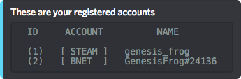

# Accounts

The accounts command allows you to add your account names \(for example steam\) to your[ profile](profile.md).

## Use:`[prefix]accounts <action> <account-platform> <account-ID>`

Example of account platforms: steam, twitch, bnet, psn, xb1, uplay, nintendo

**Actions and Aliases:**

`acc` can be used instead of accounts

Leave action blank to view registered accounts

`add/a` to add a new account

`remove/rem` to remove an account

`update/upd` to update the ID of an already registered account

## Add Account

`[Prefix]accounts add steam genesis_frog`

## Remove Account

`[prefix]accounts remove steam`

## Update Account

`[prefix]accounts update steam green_frog`

## View Registered Accounts

`[prefix]accounts`

