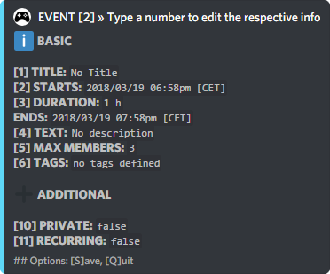
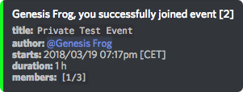
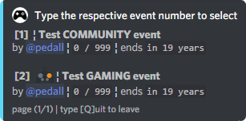
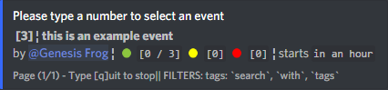

# Events

G4M3R has the best event system on Discord. It allows you to create private/public events. Private events require a password to join, which is sent to the event creator via direct message. Not only can you join/create events, you have some moderation over them. You can kick members you don't want in your event, or add members. Members can now also deny joining an event, or be added to a waiting list if the max number of members is reached. 

## Use: `[prefix]events <action> <event type/ID>`

**Actions and Aliases:**

`e` can be used instead of events

Leave action blank to view all events in the server.

`create <event type>` to create an event  
_Event type can be: gaming, community or calendar. If no event type is entered, the default is community._

`show/s <event ID>` to show the details of the event with that ID

`join/j <event ID> <pin if private>` to join that event

`leave/l <event ID>` to leave that event

`deny <event ID>` to show that you will not be joining that event

`search` to open the search menu.  
_See the 'Search for an Event' section for tips on how to use the search command_

The following actions can only be used if you are the **event creator** or a **server admin**:

`edit/e <event ID>` to edit the event with that ID

`delete/del <event ID>` to delete that event

`advertise/ad <event ID>` to display the event details to advertise the event

`pin <event ID>` direct messages you the pin of a private event

## Creating an Event

`[prefix]events create`

Enter the number corresponding to the information you would like to edit. When editing a section, just follow the instructions displayed.



Press the `enter` key to save your changes.  
Enter `c` to cancel the change and return to the event creation menu.  
Enter `q` to quit event creation completely.

You can set multiple reminders for events at times of your choice!

When editing the events start date and time, you no longer need to enter it as  `YYYY/MM/DD hh:mm.`   
You can enter it as any of the following:

* `Friday 22:30`
* `Tomorrow 10pm`
* `2p` \(which will change the start date to today at 2pm\)

When editing the frequency \(to change frequency, recurring must be set to true\) of the event, keep in the mind the format has to be `<number><space><unit>`

Below, the unit is shown like `this`

`mo` = month

`w` = week

`d` = day

`h` = hour

`m` = minute

Examples:

`2.5 h` = 2 hours and 30 minutes

`130 m` = 2 hours 10 minutes

## Private Events

When an event is set to private, the creator will be sent a pin via direct message. Any member wishing to join this event must enter the pin along with the join command.

The direct message will look like this:


So in this example, a user would type`<prefix>events join 2 9988`to join.



## View All Server Events

`<prefix>events  
<prefix>e`



## Search for an Event

`<prefix>search`

Opens up a menu allowing you to enter a search criteria. 


You can also enter your search criteria directly as part of the search command.

`<prefix>events search author: [@user / ID]   
<prefix>events search type: [event type]   
<prefix>events search tags: [tag1] [tag2] [tag3]`

Below is an example:

```text
.e search tags: search with tags
```



The event containing the tags is displayed.

