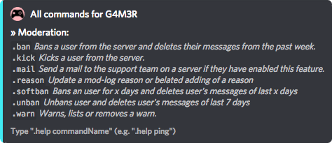

# Moderation

G4M3R has some unique features for moderation, like in-server mail!  
These commands can permanently delete user messages after they have been \(soft\)banned.

Democracy or one ban to rule them all?

* [\[Ban\]](ban.md)
* [\[Kick\]](kick.md)
* [\[Mail\]](https://github.com/pedall/g4m3r-wiki/tree/e02c9f1e99118cbc5606efe0a929aec2ad537940/commands/moderation/mail.md)
* [\[Reason\]](reason.md)
* [\[Softban\]](https://github.com/pedall/g4m3r-wiki/tree/e02c9f1e99118cbc5606efe0a929aec2ad537940/commands/moderation/softban.md)
* [\[Unban\]](https://github.com/pedall/g4m3r-wiki/tree/e02c9f1e99118cbc5606efe0a929aec2ad537940/commands/moderation/soft-ban.md)
* [\[Warn\]](warn.md)

To view the in-chat overview of all moderation commands use: `[prefix]h mod`

