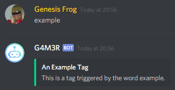
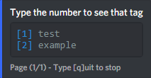
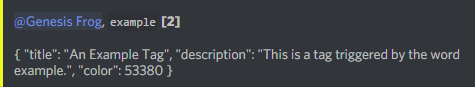

# Tag

A tag can be an [embed](embed.md) or just text. The bot posts the content of a tag when a user uses the tag word, without the need of a prefix.

## `Use: <prefix>tag [action: add, remove, show] [ID]`

**Actions and Aliases:**

_leave action and ID blank to view all server tags_

`add / a [tag name] [tag content]` to create a tag

`remove / rem [tag name or ID]` to remove a tag

`show / s [tag name or ID]` to show the content of a tag

## Creating a Tag

You can use the embed builder linked in the embed page \(also found by entering `[prefix]h embed` in discord\) to create sleek looking embeds. Embeds can also be just and image or gif, without showing the link.

`<prefix>tag add example { "title": "An Example Tag", "description": "This is a tag triggered by the word example.", "color": 53380 }`

## View All Server Tags

`<prefix>tag`

Simply shows a list of all the tags on the server. Entering the ID of a tag shows you the content.

So if I want to view the content of the example tag, I enter the number 2.

If the ID or name is known, the content of the tag could also be viewed by entering the command `<prefix>tag s 2`

