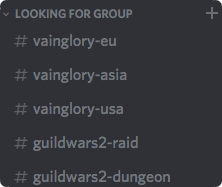
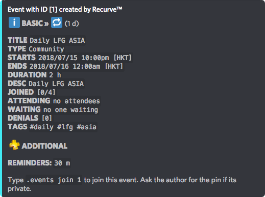
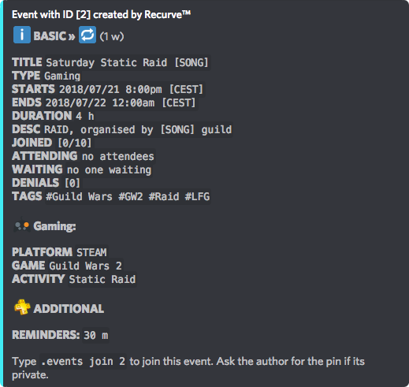

# LFG - Looking For Group

## What is an LFG Module?

A LFG \(Looking For Group\) module is a way for players to find other players on your server. We designed this module to be extremely customisable for each server. This guide will cover the LFG module, feel free to customize in any way you'd like!

## Step 1: Understanding

The LFG Module has two core pieces, server settings and events. Lets dive into both of them:

### Server Settings

The most basic part here is to create and set up default settings for your LFG Module for your server. To do this we first go into the **Settings** command:

Choose option 5, to go into the Events menu:    

Its easier to start at the top, choose 1 to open **Event Permissions**.    

1. **Creation permissions** are what define which type of users can create **events**. You can choose 3 different possibilities:
   1. All Users
   2. Mods + Admins
   3. Admins Only
2. **Add Member Permissions** is what defines which level of permission you need to forcibly **add a member** to an event. Be careful with these settings as they can be abused.

### Default Event Settings:

Now lets take a look at the default event settings:    

1. We recommend you to customise these settings and then turn on **"Use Default"**. This will not only make it easier for your members, especially if you are one game / platform focused. But it will also ensure it has a good base setting.
2. You can set this bot to _Gaming, Community_ or _Calendar_ event. Depending on your server and LFG event plans!
3. Also this you can set to your own liking, as shown in the image above, it is currently set to 2 hours.
4. Set the attendees to however big your standard party is.
5. Set up the platform accordingly to your server.
6. You can also set a default game.
7. The **Advertisement channel** is a really nice feature, as you can pre-define where your events will be advertised in the server. This can also be redefined while creating an event.
8. When ****the **Advertise All Events** option is turned on, every _event will be advertised_. No exceptions.
9. Set-up the **Default Reminder Time** as you would like, this can be minutes, hours, days etc.

Now you have prepared your server properly and set it to your own liking!


The command [UserSettings](../commands/basic/usersettings.md) allows everyone to create their own default event settings!


## Step 2: Setting up LFG

### Setting up channels:

Depending on the size and purpose of your server you should consider setting up channels, roles and regions for your game\(s\).

This is completely up to you but to make LFG work properly at least create a channel for the game to advertise the LFG events separately from your normal event advertisement channel.  
You can also create the channels with separate games, regions or even servers.  
  
_Here are some examples:_  
  

### First LFG Event:

To start off your LFG module, create an event. How to can be found here: [Event](../commands/community/events.md).  
Once the event is created, go into the LFG channel created in the previous step and use the command `[prefix]`**`e ad eventid`** to advertise the event. Replace eventid with the ID of the event you created.  

This will create an advertisement in that channel as well as post it in the default LFG channel you created. Please make sure that the bot has **Add Reactions** permissions enabled in these channels so that it can add those reactions.  
In order to join, the only thing that players have to do is tap the ✅ in order to join and ❌ to leave.

**Some examples of LFG events:**  
24h recurring LFG at the peak time created separately for every region on the server.  
  

  
Weekly recurring raid LFG on Saturday at 8pm for EU for specified guild.  
  

**Note:** Please make sure the bot also has **Manage Messages** permission in these channels so that it can delete these extra messages that are sent when a person leaves or joins.

**Advanced Users:** You can also create a \#custom-lfg channel where you allow other users to create their own events. For example, some users on a server can handle a higher amount of responsibility and they can be given permission to create and manage events on a separate channel for advanced levels.

