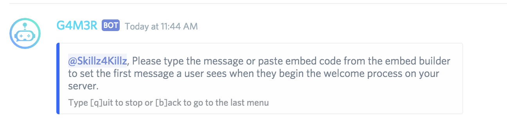

# Verification System

## What is a Verification System?

A verification system is a process that server owners can create on their servers to have users go through a series of steps in order to verify that they completed those steps and unlock access to all the channels. Until a user completes the verification process they are unable to see any other channels.

## Step 1: Creating The Verification Settings

First we open up the settings menu:

Next we go under the Moderation settings:

Next we go into \#8: Verification System

Now we input **1** to enable the Verify Status. This will take a short amount of time as it does the following steps:

1. Create a role called **Verify**
2. Create a category on the server called **Verification Zone**
3. Create a Verify Channel
4. Edit every channel and category permissions to disable **Read Messages** permission for the Verify role.
5. Enable all **Mod Roles**  and  **Bot Admins** to be able to view the Verification Zone and channel.

Once it has completed these steps you will see the following:

For now let us skip the Verify First Message and we will come back to it in [Step 2B](verification-system.md#step-2b-setting-the-first-message).


**Advanced Users:** You are able to change the Category or Role to whichever role and category you desire but we highly recommend using the default settings.



**DANGEROUS:** Reset Verification System will remove the channels, category, and roles associated with the Verification System if you click the Check Reaction.


## Step 2: Creating The Embeds

Step 1 was really easy as most of it was made automatically. Step 2 is the hardest part of the Verification system. You have to create the embeds for the **tags** or **stories** you want to use in your process.

### Step 2A: Base Message In \#verify Channel

The \#verify channel will be where all members joining the server will join and should have a message they can see that shows them how to start the verification process. To do this you simply go to the \#verify channel and use the **embed** command to create your base message. Remember to make sure to tell your users how to begin the verification system by using the verification command. In my server, the prefix is "." so I will be asking them to type **.verify**


Always avoid having conversation or messages in this channel except this base message so when a user joins the server and this is the **ONLY** channel they can see it is easy for them to know what to do to start.


When a user joins the server and types **.verify** the message they typed will be deleted by the bot so the channel is kept clean for new users. Sometimes users will talk in this channel and it is recommended to use the **nuke** command to delete those messages once that conversation is finished.

The reason we do not delete **every** message on this channel automatically with the bot is because sometimes new users may have difficulty with the process so it is good for them to be able to talk and ask for help.


**Advanced Users:** As a cool addition, you can use the **permission** command to disable all the commands on \#verify channel except the **verify** command so no other commands will work on the main \#verify channel.


### Step 2B: Setting The First Message

So what happens when a user types **.verify**?

1. Delete the **.verify** message the user typed in \#verify to keep the channel clean.
2. Make a new channel using their username.
   1. If they have an open channel already, the bot will not make more channels to avoid spam and will just alert the user to use the other channel.
3. In the new channel created, @user and send the **first message**.

In order to set the **first message**, we have to go back into the settings &gt; Moderation &gt; Verification System &gt; **3**. The bot will ask you to paste the embed code, for the first message. Once you have pasted it, exit out of the settings. In \#verify channel, type **.verify** to confirm that the first message looks good.

In the first message, you can ask your users to take the first step in your process. In my case, I asked them use the **vainglory** command to save their In Game Name into the bot so they can easily get their statistics.


Never forget to make sure to include a line telling the user on how to proceed to the next step. In the image above, you can see the user is asked to type **toys** to go to the next step. I highly recommend using the footer in an embed to show your users on what to do for the next step.



**Note:** Toys is not a bot command. It is a **tag** that we will create now.


### Step 2C: Creating Your Second Step Tag

If you are not aware of what a **tag** is please read about [here](https://github.com/pedall/g4m3r-wiki/tree/1a68f43ad7f01cf90b0f2f0bcaa4f68ef05dd92a/guides/commands/utility/tag.md).


**Advanced Users:** You can also use **Stories** instead of a tag if you prefer. Learn more about what a story is [here](https://github.com/pedall/g4m3r-wiki/tree/1a68f43ad7f01cf90b0f2f0bcaa4f68ef05dd92a/guides/commands/utility/stories.md).


Now the user will type what you ask them to type to continue to the next step. In our case, we asked the user to type **toys**.


**Advanced Users:** You can enable tag/story trigger deletion in **Settings** command in order to keep the channel cleaner and a much more professional feeling for users.


In my second step, I provide users a variety of different tags they can type to get access to those information. Let's suppose the user is interested in playing in our upcoming Talent Show league.

This gives them all the information they need to be able to join the talent show.

Once the user is finished as per the last step, they type **finish** to get to the last step.

### Step 2D: The Last Step

The last step in the verification system must always have users type **.verify end**

When a user types **.verify end**, the bot will do the following:

1. Remove the @verify role from the user so they gain access to all their channels on the server.
2. Delete the channel it was used in.

## Additional Advanced Tips

### Automated Channel Deletion

Discord only allows a maximum of 50 channels in a category and a maximum of 500 channels on a server. In order to make sure that no server is overloaded, we delete all verification channels **EXCEPT** \#verify after 10 minutes of inactivity. If no one sends a message in that channel for 10 minutes, the channel will be deleted and they will have to restart the process.

### Large Servers With 50+ Users Joining

When and if a server has more than 50 users trying to verify at the same time the bot will make a verification channel outside the main Verification Zone category. It will be a bit ugly, but remember only Admins and the user themself can see these channels. Majority of your users will not be effected. Nevertheless, once they complete the verification the channel will delete itself or it will be deleted after 10 minutes.

### Auto Assign Role

The bot also has a feature that can auto assign a role to a user when they join a server. This role is not assigned when you have the Verification System enabled. Once the user completes the verification process, the bot will assign the **Auto-Assign Role.**

### Setting A Role Message

You can set a Role Message alert to be sent under **Settings &gt; Moderation &gt; Role Messages** to send a message when the @verify role is removed or when the Auto Assign Role is added in a channel where you want the user to be alerted once they complete the verification process. For example, the Arena of Valor server moderators created this feature on their server to show even more cool information that the bot can do on their server once they complete the verification process.

