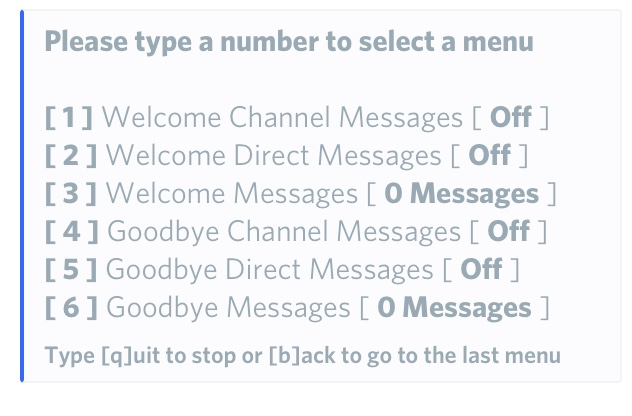
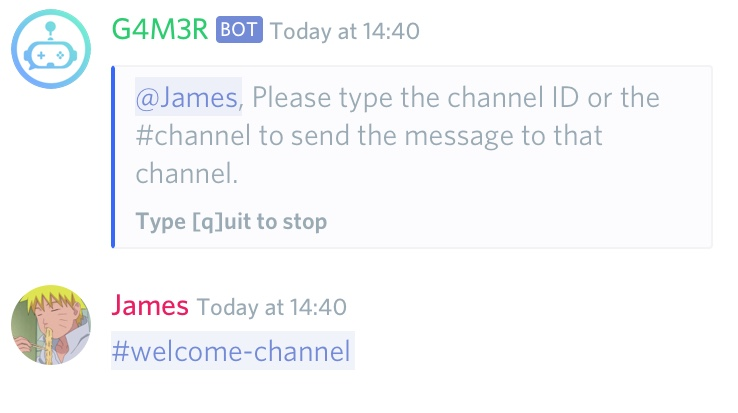

# Welcome / Goodbye Module

## Creating Welcome Messages

Let's start by opening the settings menu with `.settings`

* Now go to Moderation
* Finally we arrive at Welcome/Goodbye

You should see a menu that looks like this:

### Step 1: Enabling Messages

First, we will enable the welcome messages in this case on a channel. 

### Step 2: Adding A Welcome Message

Now we choose the **Welcome Messages** option and the bot will ask you to enter the new message or code that you would like.


You can make a nice embeded welcome message using the Nadeko embed builder! Check it out: [embedbuilder.nadeko.me](http://embedbuilder.nadeko.me)



 **Advanced Users:** • `%author%`, `%authorimage%`, `%authormention%` • `%user%`, `%userimage%`, `%usermention%` • `%guild%`, `%guildimage%`   
**»** User variables only work when mentioning a user together with the command   
**»** Guild variables only work when command is used in a guild channel


### Step 3: Choosing The Channel

Now you should enter the channel you wish your new welcome messages to be sent in whenever a user joins the server.


Done! And don't worry, if you change your mind about something, you can edit your new message at any time, or turn it off completely!


### Private Welcome Message

If you want your welcome message to be sent to the new member via DM, you can do that by turning on  Welcome Direct Messages instead of Welcome Channel Messages in the menu from [Step 1](welcome-goodbye-messages.md#step-1).


**Advanced Users:** You can add multiple messages and when the user joins the bot will select one at random.


## Creating Goodbye Messages

### Step 1: Enabling Messages

This time we will enable the Goodbye Channel Messages so that we can send a message when a user leaves.

### Step 2: Adding A Goodbye Message

The same steps are followed as you created the welcome message in [Step 2](welcome-goodbye-messages.md#step-2-adding-a-welcome-message).

### Step 3: Choosing The Channel

The same steps are followed as you created the welcome message in [Step 3](welcome-goodbye-messages.md#step-3-choosing-the-channel).


Done! Remember you can edit your goodbye message at anytime, or turn if off completely.


### Private Goodbye Message

If you want your goodbye message to be sent to the user via DM, you can do that by turning on Goodbye Direct Messages instead of Goodbye Channel Messages in the menu from [Step 1](welcome-goodbye-messages.md#step-1-1).


Note: This will only work if the bot has another server in common with the user that's leaving your server.



**Advanced Users:** You can also set up multiple goodbye messages and the bot will pick the message at random when someone leaves.


