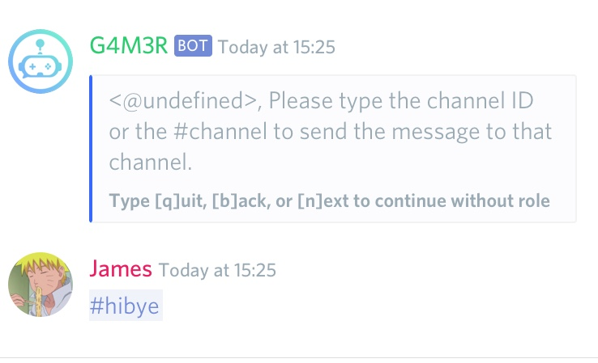

# Welcome / Goodbye messages

## Adding a new Welcome message

Let's start by opening the settings menu with `.settings`

* Enter option 3 \(Moderation\)
* Now option 6 \(Welcome/Goodbye\)

You should see a menu that looks like this:

### Server welcome message

#### Step 1

Type 1 to turn on Welcome Channel Messages.

#### Step 2

Type 3, and then the bot will ask you to enter the new message or code that you would like.


You can make a nice embeded welcome message using the Nadeko embed builder! Check it out: embedbuilder.nadeko.me


#### Step 3

Now you should enter the channel you wish your new welcome message to be sent in.


Done! And don't worry, if you change your mind about something, you can edit your new message at any time, or turn it off completely!


### Private welcome message

If you want your welcome message to be sent to the new member via DM, you can do that by turning on  Welcome Direct Messages instead of Welcome Channel Messages in the menu from [Step 1](welcome-goodbye-messages.md#step-1).

## Adding a new Goodbye message

### Server goodbye message

Let's start by opening the settings menu with `.settings`

* Enter option 3 \(Moderation\)
* Now option 6 \(Welcome/Goodbye\)

You should see a menu that looks like this:

#### Step 1

Type 4 to turn on Goodbye Channel Messages

#### Step 2

Let's create your new goodbye message by choosing option 6, and then entering your new message or code from the embed builder.


You can make a nice embeded message using the Nadeko embed builder! Check it out at [embedbuilder.nadeko.me](https://embedbuilder.nadeko.me).


#### Step 3

Now you should enter the channel you wish your new goodbye message to be sent in.


Done! Remember you can edit your goodbye message at anytime, or turn if off completely.


### Private goodbye message

If you want your goodbye message to be sent to the user via DM, you can do that by turning on Goodbye Direct Messages instead of Goodbye Channel Messages in the menu from [Step 1](welcome-goodbye-messages.md#step-1-1).


Note: This will only work if the bot has another server in common with the user that's leaving your server.


